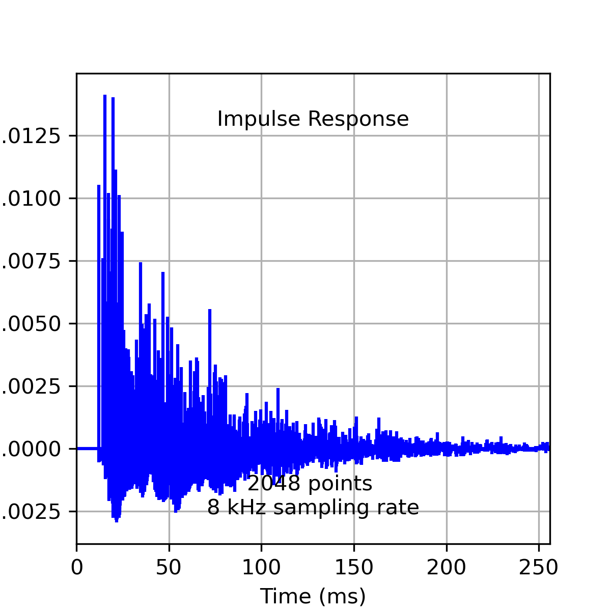

Home 
====

Time domain
-----------

Plot a typical impulse repsonse for a room 80 x 12 x 100 sample lengths
long. Wall reflection coefficients were all 0.9, ceiling and floor
coefficients were 0.7. Source and receiver were at (30, 100, 40) amd
(50, 10, 60) sample periods [1].

   Room impulse repsonse in time-domain

Installation
------------

The python libraries necessary ro run this can be installed using
``pip`` as follows

.. code:: bash
   $ pip install . 
   $ pip install -r requirements.txt

Testing
-------

The unit tests are located in the ``tests`` directory, they can be run
from the root directory

.. code:: bash

   $ python -m unittest discover -s tests

References
----------

1. Allen, J. B., & Berkley, D. A. (1979). Image method for efficiently
   simulating small‐room acoustics. The Journal of the Acoustical
   Society of America, 65(4), 943-950.
   `Available <https://asa.scitation.org/doi/abs/10.1121/1.382599>`__
2. Lehmann, Eric A., and Anders M. Johansson. “Prediction of energy
   decay in room impulse responses simulated with an image-source
   model.” The Journal of the Acoustical Society of America 124.1
   (2008): 269-277.
   `Available <https://asa.scitation.org/doi/full/10.1121/1.2936367>`__

